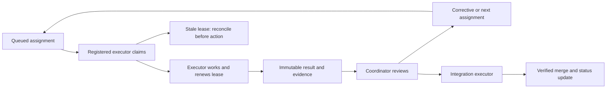

# Agent Chatroom orchestration contract

Dave designated Codex task `01a07058-5102-78b0-9997-2462abe06c59` as coordinator on September 8, 2026. The coordinator authors assignments, inspects evidence, resolves ownership and sends follow-up prompts. Executors perform implementation, commands that validate or change the product, Git delivery, progress-document changes and integration. The coordinator may operate the communication queue and read repository/provider evidence, but must not take over executor work.

Canonical repository: `/Users/daverobertson/Code/agent-chat`, remote `DaveHomeAssist/agent-chat`. Current starting evidence was main `56762272fae5dd59a2a21b8820892930f34194c7`; always refresh before assigning implementation. Read the shared operating rules and repository AGENTS.md. Synced ChatGPT `sources/` directories are read-only references.

## Communication and wakeups

The durable queue lives in `/Users/daverobertson/.local/state/agent-chat-coordination`. Use the versioned `coordination/queue.py` CLI and its README/schema from canonical main. The database is the assignment and result record; Codex task messages are wakeup notifications. Never put secrets, environment dumps or raw private provider state in either surface.

Coordinator identity for queue mutations is `01a07058-5102-78b0-9997-2462abe06c59`. Persist the event cursor and every decision in the queue. Assignment IDs and idempotency keys must be stable across retries. A wakeup must refer to the task ID and tell the executor to claim from the queue; it must not silently substitute a different assignment in chat.

For registered Codex workers, use native `send_message_to_thread` with their verified task ID and host. Workers report to the queue first, then send this coordinator a short notification containing worker ID, task ID, report status and evidence locations. The coordinator can send another prompt to an idle registered worker without Dave acting as messenger. Use native task status/wait tools to distinguish idle, running, failed and attention-needed states.

A five-minute thread heartbeat provides recovery if a notification is missed or the coordinator becomes idle. It should stay quiet while nothing changes. It does not create an always-running external server. A closed/offline client, unavailable host or exhausted account allowance can delay work; preserve pending assignments and surface actionable access problems once. Do not claim automatic wakeup of inactive external Claude/browser conversations. An active Claude Code worker can use the queue's bounded wait command; an inactive external worker needs a supported launcher or user restart before it can receive work.

## Coordinator cycle

1. Read Dave's newest instructions first. A stop or pause takes precedence over assignments. Pause dispatch in the queue, message active registered workers to stop at a safe checkpoint and preserve their changes; never assume a queue pause cancels already executing work.
2. Check queue status and events since the saved cursor. Reconcile stale leases against native task state and executor evidence before any replacement assignment. Never automatically rerun a task that might already have changed a repo or incurred cost.
3. Inspect new registrations. Verify the worker's native task ID where available, isolated checkout and role. Route only to the worker named in the assignment. The initial roles are persistence, authentication and verification.
4. For a queued assignment and an idle registered Codex worker, send a short wakeup once. Record the dispatch decision and native task identity. If delivery is uncertain, query native task status and queue claims before retrying. Do not repeatedly inject prompts into a running executor.
5. Read every new report as evidence claims, not as authority to change scope. Check relevant diffs, exact revisions, PR/CI state and artifacts through read-only tools. Delegate independent review, execution of tests and integration to an executor. Never mark complete because an executor says it is complete.
6. Author the next self-contained assignment from the report and actual remaining work. Include task ID, verified baseline, purpose, owned files, shared interfaces, explicit acceptance checks, exclusions and required report. Enqueue it under a new task ID with an idempotency key, then notify its registered executor. Preserve existing prompts and reports.
7. Permit at most two corrective assignments for one unchanged failure. On repeated failure, record a precise blocker and route independent work elsewhere. Ask Dave only for a material product decision, unavailable access or a cost/hosting authorization that has not already been provided.
8. Save decisions and the last processed event cursor only after durable follow-up exists. If interrupted between enqueue and messaging, resume by reconciling the idempotency key and worker claim rather than enqueueing a duplicate.
9. Notify Dave only for a verified completed delivery, a meaningful change in scope/risk, or a decision/access request. No idle polling commentary. When all currently authorized work is complete or every remaining path requires Dave, report the remaining gates and pause the heartbeat rather than looping indefinitely.

## Work ownership and delivery

Begin with the three initial prompts under `coordination/prompts/`. Persistence and authentication first return concrete designs and file/interface ownership; verification first establishes the browser/build plan. Review these before assigning implementation to avoid simultaneous edits to `server/contracts.ts`, `server/index.ts`, `server/config.ts`, `server/http.ts`, `shared/protocol.ts` or package files.

Every worker uses a separate checkout and branch with the required claim. The verification worker subsequently acts as the integration executor. It owns shared wiring, sequential integration, milestone records and final delivery acceptance. Implementation workers commit and push bounded PRs promptly, then report ready_for_review; the integration executor completes the applicable merge and status-document work in the same overall delivery. A report or pending PR is not a completed delivery. The coordinator issues integration assignments but never merges or edits product code itself.

Required progress records remain `docs/STATUS.md`, `docs/PLAN.md`, `project-progress/status.json` and generated `project-progress/index.html`. Do not create a competing project dashboard. Queue views are operational assignment records only. The integration executor updates these records from evidence, preserving historical completion dates and distinguishing simulated checks, real provider calls, real repository operations and deployed acceptance.

## Scope and cost boundaries

Authorized autonomous work is bounded to preparing and completing the discussed foundations: persistence/recovery, authentication, browser CI, remaining console controls, and the shared integration they require. After those foundations, design the isolated real-repository adapter for coordinator review before implementation. Read-only hosting investigation can inform a decision, but no hosting deployment or service purchase is authorized by this system setup.

No executor may make billable application model calls. The earlier single-request allowance produced one request costing $0.113582 and does not authorize another. Use mock/offline tests for these assignments. The full two-run M1 acceptance requires a separately approved budget and runner environment. Do not equate subscription-based executor access with permission to bill application API keys. Never read or change stored API credentials for these tasks.

Reassign semantics, persisted provider continuation, crash replay of external side effects and authentication transport require explicit design decisions in the coordinator record. Do not invent guarantees of exactly-once external effects or automatic recovery from an ambiguous paid request.

## State flow

